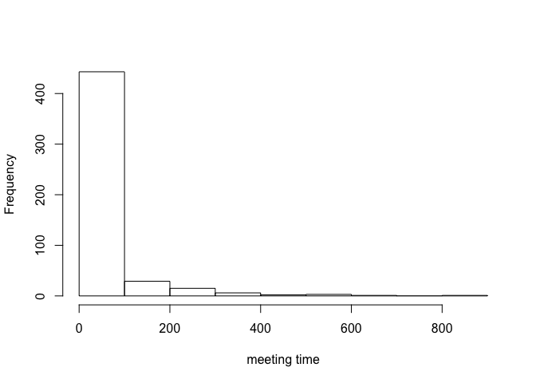
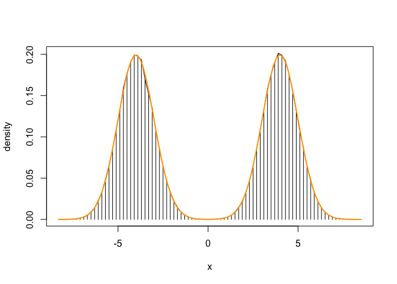

## unbiasedmcmc

This package contains scripts to reproduce the results of the arXiv
report “Unbiased Markov chain Monte Carlo with couplings”, by Pierre E.
Jacob, John O’Leary and Yves F Atchade, available at
<https://arxiv.org/abs/1708.03625>.

This is not a general-purpose statistical software, but a collection of
scripts intended to reproduce figures and tables. Use at your own
risk\!\! We hope these scripts will be useful for people interested to
learn how the method works.

The folder inst/reproduce/ contains the scripts to reproduce the
figures. Each sub-folder has a “run all” script to run all the scripts
in the correct order. The folder inst/check/ contains internal checks,
and vignettes/ contains tutorials on how to use the package’s main
functions.

### Installation

The package can be installed from R via:

``` r
# install.packages("devtools")
devtools::install_github("pierrejacob/unbiasedmcmc")
```

It depends on the packages Rcpp, RcppEigen, lubridate, which can be
installed via:

``` r
install.packages(c("Rcpp", "RcppEigen", "lubridate"))
```

Additionally you might want to install other packages, to help with
parallel computation:

``` r
install.packages(c("doParallel", "doRNG"))
```

and to help with manipulating results and plotting:

``` r
install.packages(c("dplyr", "tidyr", "ggplot2", "viridis"))
```

although these packages are not strictly required (see below for an
example that does not require these packages).

The Polya-Gamma sampler is taken from the package BayesLogit of Nick
Polson, James Scott, and Jesse Windle
(<https://cran.r-project.org/src/contrib/Archive/BayesLogit/>). That
package can be downloaded and installed with “R CMD INSTALL”. Or in R
via

``` r
packageurl <- "https://cran.r-project.org/src/contrib/Archive/BayesLogit/BayesLogit_0.6.tar.gz"

install.packages(packageurl, repos=NULL, type="source")
```

Note that the above requires gfortran to compile. For instance on Mac OS
X gfortran can be found on
<https://github.com/fxcoudert/gfortran-for-macOS/releases>. In any case,
the package does not require BayesLogit to be installed; only the
scripts dealing with the Polya-Gamma sampler do.

### Usage

The following code

  - defines a target distribution as a mixture of univariate Normal
    distributions, via its probability density function, returning
    log-values,

  - defines an initial distribution “rinit”, a Markov kernel
    “single\_kernel”, and a coupled Markov kernel “coupled\_kernel”,
    defined through their sampling mechanisms,

  - draws meeting times and shows a histogram of them,

  - draws more coupled chains, with a certain “lag” and time horizon
    “m”, and use them to produce an approximation of the target
    distribution.

<!-- end list -->

``` r
library(unbiasedmcmc)
set.seed(1)
# target distribution
target <- function(x){
  evals <- log(0.5) + dnorm(x, mean = c(-4, 4), sd = 1, log = TRUE)
  return(max(evals) + log(sum(exp(evals - max(evals)))))
}
# get MH kernels with proposal variance equal to 4 
kernels <- get_mh_kernels(target, 4)
# Markov kernel of the chain
single_kernel <- kernels$single_kernel
# Markov kernel of the coupled chain
coupled_kernel <- kernels$coupled_kernel
# initial distribution, towards the right-most mode of the target
rinit <- function(){
  chain_state <- rnorm(1, mean = 3, sd = 2)
  current_pdf <- target(chain_state)
  return(list(chain_state = chain_state, current_pdf = current_pdf))
}

# draw meeting times
nrep <- 500
meetingtimes <- rep(0, nrep)
for (irep in 1:nrep){
  meetingtimes[irep] <- sample_meetingtime(single_kernel, coupled_kernel, rinit)$meetingtime
}
# plot histogram of meeting times
hist(meetingtimes, xlab = "meeting time", main = "")
```

<!-- -->

``` r
# now run coupled chain, with lag of 500, time horizon m = 2000
coupledchains <- list()
for (irep in 1:nrep){
  coupledchains[[irep]] <- sample_coupled_chains(single_kernel, coupled_kernel, rinit, m = 2000, lag = 500)
}

# approximate target via histogram, with k = 500, m = 2000
hist1 <- histogram_c_chains(coupledchains, 1, k = 500, m = 2000, nclass = 100)
# plot approximation in black segments
plot(x = hist1$mids, y = hist1$proportions / hist1$width, type = "l", xlab = "x", ylab = "density")
segments(x0 = hist1$mids, x1 = hist1$mids, y0 = rep(0, length(hist1$proportions)), y1 = hist1$proportions / hist1$width)
curve(sapply(x, function(v) exp(target(v))), add = TRUE, col = "orange", lty = 1, lwd = 2)
```

<!-- -->

``` r
# average cost per estimator, in units of "calls to Markov kernels"
mean(sapply(coupledchains, function(x) x$cost))
```

    ## [1] 2062.668

We can see that in average, the cost of each estimator is not much more
than if we had just run the MCMC algorithm for “m” steps.

From the coupled chains, we can obtain unbiased estimators of
expectations with respect to the target distribution. For instance, with
the function “identity”, we can estimate unbiasedly the mean of the
target. The following code plots these estimators obtained for each
chain, and construct a 95% confidence interval, based on a central limit
theorem as the number of independent estimators goes to
infinity.

``` r
estimators <- sapply(coupledchains, function(c) H_bar(c, h = function(x) x, k = 500, m = 2000))
hist(estimators, xlab = "unbiased estimators of the mean", main = "")
```

<!-- -->

``` r
cat("95% confidence interval for the mean:", mean(estimators), "+/-", 1.96 * sd(estimators)/sqrt(length(estimators)), "\n")
```

    ## 95% confidence interval for the mean: 0.03452407 +/- 0.1422636

Compared to usual MCMC estimators justified as the number of iterations
goes to infinity, the proposed estimators are unbiased, and thus their
averages are consistent when the number of independent replicates goes
to infinity.
